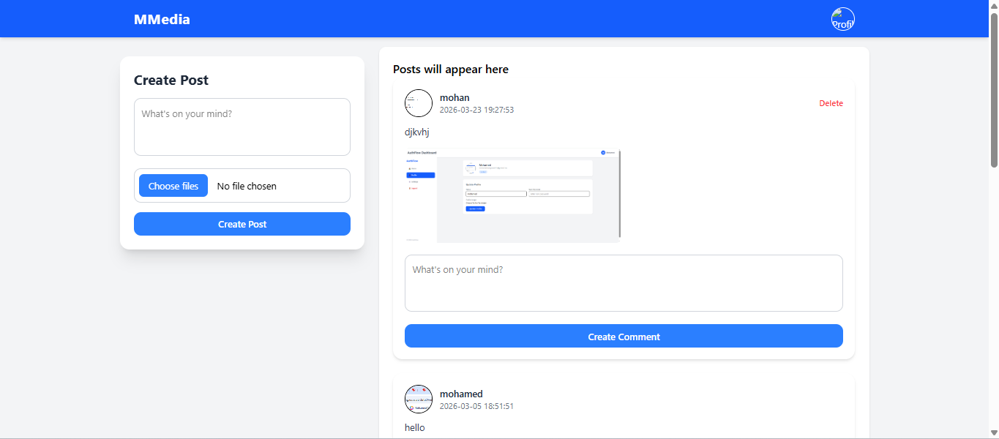
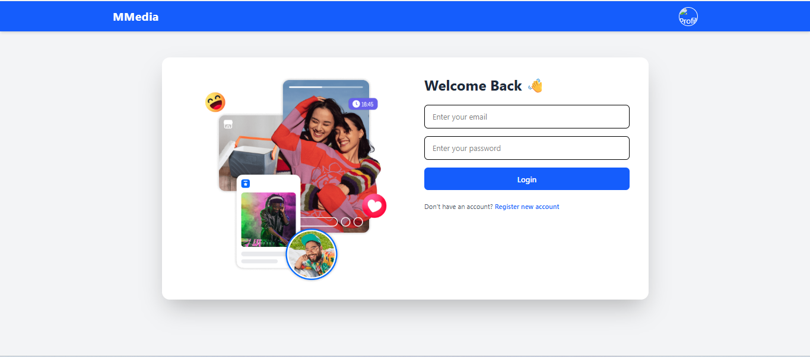
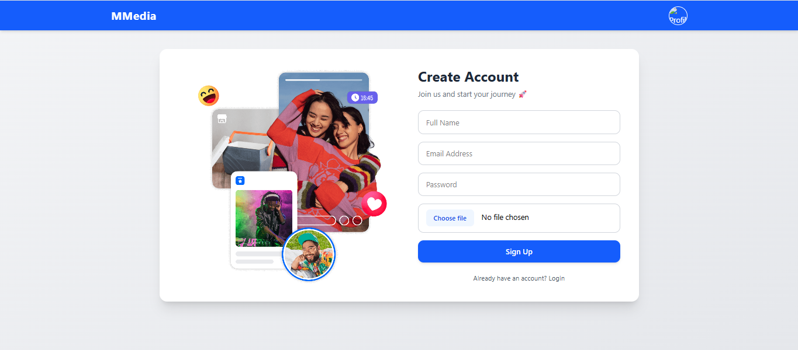

# 🌐 Connectify

A full-stack social media platform where users can register, log in, create posts, comment, and manage their profiles. Built with modern frontend and backend technologies, this project demonstrates real-world application architecture using React, Redux, PHP (MVC), and MySQL.

---

## 🚀 Features

- 🔐 User Authentication (Login & Signup)
- 🔒 Secure Password Hashing
- 🛡️ Token-Based Authentication
- 👤 User Profile with Image
- 📝 Create Posts (Title + Image)
- 📰 View All Posts Feed
- 💬 Comment on Posts
- ❌ Delete Own Posts Only
- 🔄 Real-Time UI Updates with Redux
- 📱 Fully Responsive Design

---

## 📸 Screenshots

### 🏠 Home Page



### 🔐 Login Page



### 📝 Signup Page



---

## 🛠️ Tech Stack

### Frontend

- React.js
- Redux Toolkit (Global State Management)
- Tailwind CSS
- React Router

### Backend

- PHP (MVC Architecture)
- MySQL Database
- RESTful API

---

## 🧠 Concepts Applied

- MVC Architecture (Model → View → Controller)
- RESTful API Design
- Authentication & Authorization
- State Management with Redux
- File/Image Handling
- Secure Backend Practices

---

## 📁 Project Structure

```txt
connectify-fullstack/
  backend/
    controllers/
    models/
    views/
    config/
    routes/

  frontend/
    components/
    pages/
    redux/
    layouts/

  docs/   # screenshots
```

---

## 🔐 Authentication Flow

1. User signs up → Password is securely hashed
2. User logs in → Authentication token is generated
3. Token is stored on frontend
4. Protected routes verify token
5. Authenticated user can access posts & profile

---

## 📝 Post & Comment Flow

1. User creates a post (title + image)
2. Post is stored in database
3. All users can view posts feed
4. Users can comment on posts
5. Users can delete only their own posts

---

## 🗄️ Database Setup

1. Create a MySQL database:

```sql
CREATE DATABASE connectify;
```

2. Import your database file:

```bash
mysql -u root -p connectify < backend/database/connectify.sql
```

3. Configure your database connection in backend:

```env
DB_HOST=localhost
DB_USER=root
DB_PASS=
DB_NAME=connectify
```

---

## ⚙️ Getting Started

### Clone the repository

```bash
git clone https://github.com/tubeec1/connectify-fullstack.git
cd connectify-fullstack
```

---

### Backend Setup (PHP)

- Move backend folder to your server (XAMPP / Laravel Valet / etc.)
- Configure database connection
- Start Apache & MySQL

---

### Frontend Setup

```bash
cd frontend
npm install
npm run dev
```

---

## 🌍 Deployment (Planned)

- Frontend → Vercel
- Backend → Shared Hosting / VPS
- Database → MySQL (Railway / Hosting)

---

## 💡 Future Improvements

- ❤️ Like & Reaction System
- 🔔 Notifications
- 🧑‍🤝‍🧑 Follow / Friend System
- 📩 Real-Time Chat (WebSockets)
- ☁️ Cloud Image Upload (Cloudinary)

---

## 👨‍💻 Author

Mohamed Suleyman Ibrahim
Full Stack Developer

---

## ⭐ Support

If you found this project helpful, consider giving it a ⭐ on GitHub!
